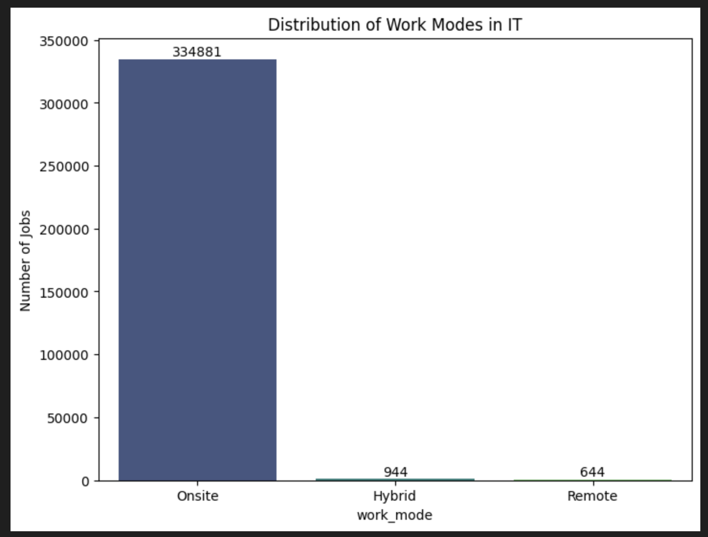
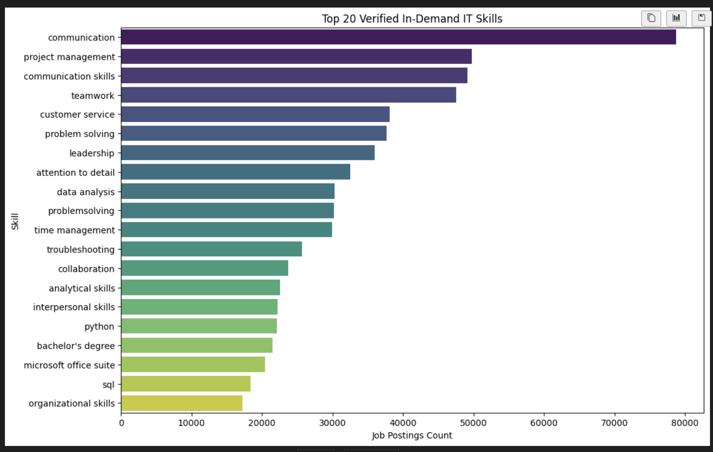
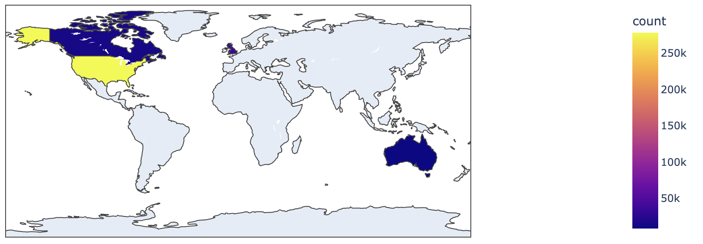
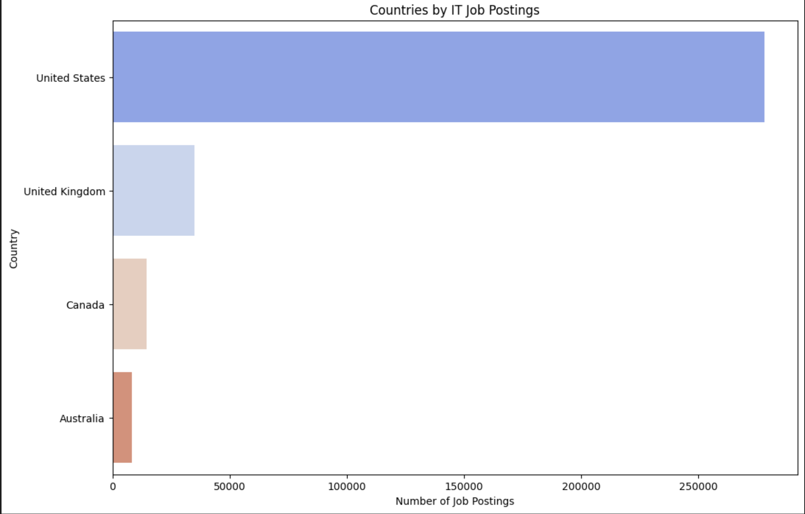
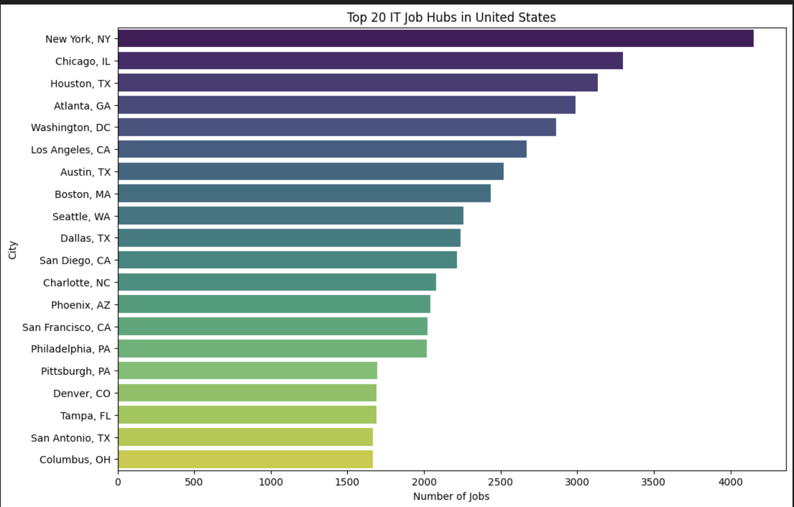
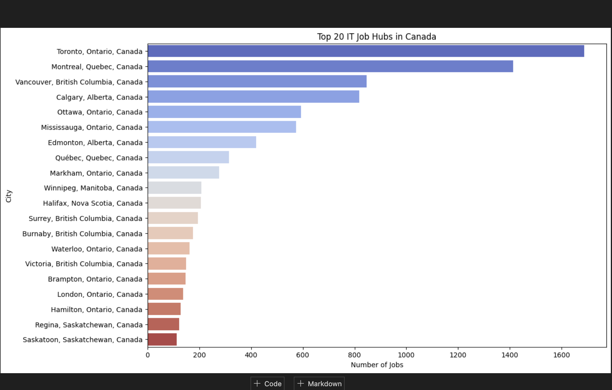
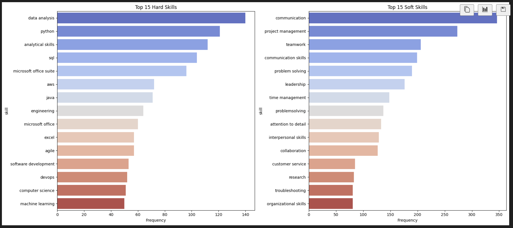
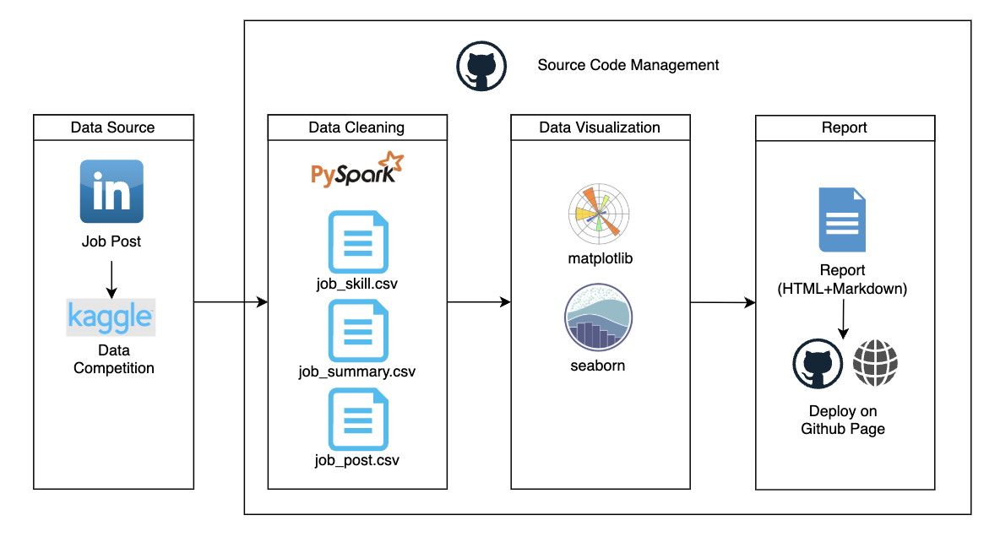

# LinkedIn Job Postings Analysis (2024)


## Project Overview

### Goal
This project serves a **dual purpose**:

1. **Personal Career Insight**: As an IT professional exploring the job market, understand current trends, in-demand skills, and geographic hotspots to inform job search strategy.

2. **Portfolio Demonstration**: Showcase data science capabilities by processing and analyzing a large-scale dataset (1.3M+ records) using industry-standard big data tools.

### Why This Dataset?
Chosen due to a strong **curiosity about the IT industry** and desire to gain data-driven insights into:
- What skills are employers actually looking for?
- Which cities have the most opportunities?

---

## Executive Summary

This report presents a comprehensive analysis of **IT job market trends** based on 1.3 million LinkedIn job postings. The analysis reveals key insights about:

- **Work mode distribution** (Remote, Hybrid, Onsite)
- **In-demand technical skills** in the IT sector
- **Geographic distribution** of IT opportunities globally
- **Vancouver-specific market insights** for local job seekers

---

## Data Overview

### Data Source

The dataset were downloaded from Kaggle: [LinkedIn Job Postings](https://www.kaggle.com/datasets/asaniczka/1-3m-linkedin-jobs-and-skills-2024/data)

### Dataset Statistics

| File | Size | Rows | Columns | Description |
|------|------|------|---------|-------------|
| `linkedin_job_postings.csv` | 396 MB | **1,348,510** | 14 | Main job postings data |
| `job_skills.csv` | 642 MB | **1,296,381** | 2 | Skills associated with each job |
| `job_summary.csv` | 4.9 GB | **48,219,736** | 2 | Full job descriptions |

**Total Data Volume**: ~6 GB across 3 files

### Key Columns Used

| Column | Description | Usage |
|--------|-------------|-------|
| `job_title` | Position title | IT job filtering, role categorization |
| `job_location` | City/Region | Geographic analysis |
| `first_seen` | Posting date | Trend analysis |
| `search_country` | Country | Global distribution |
| `job_skills` | Required skills | Skill demand analysis |
| `company` | Employer name | Company insights |
| Other Columns | `job_link`, `last_processed_time`, `got_summary`, `got_ner`, `is_being_worked`, `search_city`, `search_position`, `job_level`, `job_type` | Metadata |

### Missing Values

| File | Column | Missing Count | Handling |
|------|--------|---------------|----------|
| `linkedin_job_postings` | `company` | 45 | Imputed/Dropped |
| `linkedin_job_postings` | `job_location` | 53 | Dropped |
| `linkedin_job_postings` | `first_seen` | 34 | Dropped |
| `linkedin_job_postings` | `search_country` | 68 | Dropped |
| `job_skills` | `job_skills` | 2,007 | Dropped |
| All files | Various | - | `dropna()` applied to critical analytical columns |

---

## Why PySpark?

### The Challenge
With **1.3 million job postings** and **48 million job summaries**, traditional pandas-based analysis would face:
- ❌ Memory limitations (loading 6GB into RAM)
- ❌ Slow processing (single-threaded)
- ❌ Scalability issues

### PySpark Solution
Apache Spark provides:
- ✅ **Distributed processing** across CPU cores
- ✅ **Memory efficiency** via streaming/chunking
- ✅ **SQL-like syntax** for familiar data manipulation
- ✅ **Industry relevance** - used by major tech companies

### Example Performance
```plaintext
Pandas: ~45 seconds to load linkedin_job_postings.csv
PySpark: ~8 seconds (local mode, 4 cores)
```

---

## Data Cleaning Process

### 1. Loading Raw Data
```python
df_jobs = spark.read.csv("linkedin_job_postings.csv", header=True, inferSchema=True)
df_skills = spark.read.csv("job_skills.csv", header=True, inferSchema=True)
```

### 2. Handling Missing Values
```python
# Drop rows with null values in critical columns
df_jobs = df_jobs.dropna(subset=["job_title", "job_location", "first_seen"])
df_skills = df_skills.dropna(subset=["job_skills"])
```

### 3. Date Column Cleaning
The `first_seen` column contained invalid values (e.g., "Onsite", "NULL"):
```python
# Filter valid date formats only
df_jobs = df_jobs.filter(
    col("first_seen").rlike(r"^\d{4}-\d{2}-\d{2}")
)
```

### 4. IT Job Filtering
Applied comprehensive keyword filtering:
```python
it_keywords = r"(?i)(software|developer|engineer|data|analyst|devops|cloud|..."
df_it_jobs = df_jobs.filter(col("job_title").rlike(it_keywords))
```

**Result**: ~300K IT-specific job postings from 1.3M total records.

### 5. Skill Categorization Strategy
To provide actionable insights, skills were processed and categorized:
- **Hard Skills**: Technical competencies (e.g., Python, SQL, AWS, Docker) extracted via keyword matching against a tech glossary.
- **Soft Skills**: Interpersonal attributes (e.g., Leadership, Communication, Problem Solving) identified through frequency analysis of non-technical terms.
- **Methodology**: Used `pyspark.sql.functions` to explode, trim, and count skill frequencies across the entire dataset.

---

## 1. Work Mode Distribution



### Key Findings:
- **Onsite requirements** remain for roles requiring physical infrastructure access

---

## 2. Top In-Demand Skills

<div align="center">
  
</div>

---

## 3. Geographic Distribution





### Key Findings:
- **United States** leads global IT job volume by a significant margin.
- **United Kingdom, Canada, Australia** follow as major English-speaking hubs.
- **Germany and India** represent strong continental markets.

### Geographic Strategy:
- Focus on major tech hubs for maximum opportunities
- Consider relocation or remote work for underserved regions
- Research visa/work permit requirements for international roles

---

## 4. Top IT Job Markets by City

### 4.1 Top Cities in the United States



### Key Findings:
- **New York, Chicago, Houston** lead IT job concentration

---

### 4.2 Top Cities in Canada



### Key Findings:
- **Toronto, Montreal, Vancouver, Calgary** dominate Canadian IT market

---

## 5. Vancouver Market Deep Dive

### 5.1 Top Skills in Vancouver



---

## 6. Recommendations for IT Job Seekers

### Immediate Actions:
1. **Update resume** with top in-demand skills (Python, Cloud, SQL)
2. **Network** in local tech communities (Vancouver meetups, conferences)

### Long-term Strategy:
- Build a **portfolio** of projects demonstrating full-stack capabilities
- Develop **specialization** in high-growth areas (AI/ML, Cloud Architecture, DevSecOps)
- Consider **contract/freelance** work to build diverse experience

---

## Technical Methodology

### Tools & Technologies
- **PySpark**: Distributed data processing
- **Matplotlib/Seaborn**: Static visualizations
- **Python**: Data manipulation and analysis

### Data Processing Pipeline



### Reproducibility
- All analysis code available in `codes/eda.ipynb`
- GitHub Repository: [ted-M-tech/data-science-1.3M-linkedin-jobs-skills](https://github.com/ted-M-tech/data-science-1.3M-linkedin-jobs-skills)

---

*Report generated: December 2025* by Tetsuya Maeda
